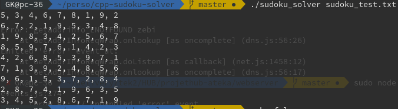

# cpp-sudoku-solver

Simple Sudoku Solver made in CPP

#### Usage
    git clone https://github.com/gabirel1/cpp-sudoku-solver.git
    cd cpp-sudoku-solver/
    make
    ./soduku_solver file

#### Example

#### How must be the given file
You Sudoku map must look like the following (0 represents empty cases). It must always be a 9x9 grid

<!> Any unvalid map will be taken so be aware of its validity <!>

    530070000
    600195000
    098000060
    800060003
    400803001
    700020006
    060000280
    000419005
    000080079
